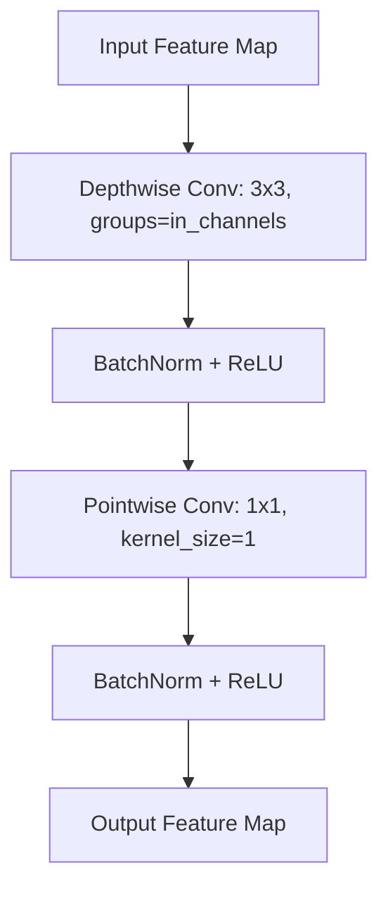

# Phân tích Chi tiết Kiến trúc Mô hình DSUnet (Dual Stream UNet)

Mô hình **DSUnet (Dual Stream / Depthwise Separable UNet)** là một biến thể tối ưu của kiến trúc UNet truyền thống. Mô hình được tinh chỉnh đặc biệt cho nhiệm vụ phân đoạn làn đường thời gian thực (Real-time Lane Segmentation) trên các thiết bị Edge/nhúng hoặc máy tính cấu hình vừa phải.

---

## 1. Bản chất Cải tiến: Tích chập Tách sâu (DSConv)

Điểm cải tiến mấu chốt giúp DSUnet giảm dung lượng từ **`31.04 triệu`** (UNet tiêu chuẩn) xuống còn chỉ **`6.00 triệu`** tham số nằm ở cấu trúc **Depthwise Separable Convolution (DSConv)**:



*   **Bước 1: Depthwise Convolution:** Thực hiện tích chập 3x3 riêng biệt trên từng kênh độc lập (không trộn kênh). Số lượng bộ lọc bằng chính số lượng kênh đầu vào (`groups = in_channels`).
*   **Bước 2: Pointwise Convolution:** Thực hiện tích chập 1x1 để trộn thông tin giữa các kênh với nhau và đưa ra số kênh đầu ra mong muốn.

> [!NOTE]
> **Hiệu quả:** DSConv giúp giảm lượng tham số và tính toán khoảng **$8 \times$ đến $9 \times$** đối với mỗi lớp tích chập 3x3 đơn lẻ mà vẫn giữ được khả năng biểu diễn đặc trưng tương đương.

---

## 2. Chi tiết Cấu trúc Từng Khối (Block-by-Block)

Kiến trúc đối xứng gồm 4 tầng Down-sampling (Encoder), 1 tầng Trung gian (Bottleneck) và 4 tầng Up-sampling (Decoder):

### A. Nhánh Encoder (Trích xuất đặc trưng)
Gồm 4 khối `EncoderBlock`. Mỗi khối chứa **2 lớp DSConv liên tiếp**, theo sau bởi Max Pooling 2x2 để giảm kích thước không gian đi một nửa:
1.  **Encoder 1:** Kênh $3 \rightarrow 64$, kích thước ảnh giảm còn $128 \times 256$ (sau Pool).
2.  **Encoder 2:** Kênh $64 \rightarrow 128$, kích thước ảnh giảm còn $64 \times 128$ (sau Pool).
3.  **Encoder 3:** Kênh $128 \rightarrow 256$, kích thước ảnh giảm còn $32 \times 64$ (sau Pool).
4.  **Encoder 4:** Kênh $256 \rightarrow 512$, tích hợp **Dropout (0.5)** để chống Overfitting, kích thước giảm còn $16 \times 32$ (sau Pool).

### B. Khối Bottleneck (Trung gian sâu nhất)
*   **Cấu trúc:** Nhận đầu vào 512 kênh từ Encoder 4, đi qua 2 lớp DSConv chuyển đổi kênh $512 \rightarrow 1024$.
*   **Đặc điểm:** Không thực hiện Pooling, tích hợp **Dropout (0.5)** để bảo vệ tính tổng quát hóa của mạng. Kích thước bản đồ đặc trưng giữ nguyên ở $16 \times 32$.

### C. Nhánh Decoder (Khôi phục không gian & Phân lớp)
Gồm 4 khối `DecoderBlock` đối xứng giúp khôi phục bản đồ đặc trưng về độ phân giải gốc thông qua cơ chế ghép kênh (Skip Connections):

```
[Bottleneck: 1024] ──> Up-Conv 2x2 ──> [512] ──┐
                                               ├──> [Concat: 1024] ──> 2x DSConv ──> [Dec 4: 512]
[Skip Connection 4 từ Encoder 4] ─────> [512] ──┘
```

1.  **Decoder 4:** Up-sampling bottleneck ($1024 \rightarrow 512$) $\rightarrow$ Concat với `Skip 4` ($512$) thành 1024 kênh $\rightarrow$ Tích chập DSConv đưa về **512 kênh**. Tích hợp Dropout (0.5).
2.  **Decoder 3:** Up-sampling Dec 4 ($512 \rightarrow 256$) $\rightarrow$ Concat với `Skip 3` ($256$) thành 512 kênh $\rightarrow$ Tích chập DSConv đưa về **256 kênh**.
3.  **Decoder 2:** Up-sampling Dec 3 ($256 \rightarrow 128$) $\rightarrow$ Concat với `Skip 2` ($128$) thành 256 kênh $\rightarrow$ Tích chập DSConv đưa về **128 kênh**.
4.  **Decoder 1:** Up-sampling Dec 2 ($128 \rightarrow 64$) $\rightarrow$ Concat với `Skip 1` ($64$) thành 128 kênh $\rightarrow$ Tích chập DSConv đưa về **64 kênh**.

### D. Lớp Dự đoán Đầu ra (Prediction Layer)
*   Sử dụng tích chập chuẩn kích thước 1x1 (`nn.Conv2d`) chuyển đổi bản đồ đặc trưng cuối cùng từ **`64 kênh` về đúng `num_classes` (9 lớp)** để đưa ra logits phân lớp cho từng pixel ở độ phân giải gốc $256 \times 512$.

---

## 3. Tóm tắt Tham số Đo lường thực tế

Khi chạy với kích thước ảnh đầu vào $256 \times 512$, các thông số chi tiết đo được như sau:

*   **Tổng số tham số:** `6,000,426` (~6.00 M)
*   **Dung lượng bộ nhớ lưu trữ:** ~24 MB (Dưới dạng FP32)
*   **Tổng số phép tính (FLOPs):** `31.466 GFLOPs`
*   **Độ trễ trung bình:** ~21ms (Chạy trên các dòng GPU phổ thông, tương đương **~47 FPS**)

---
*Tài liệu tham khảo thêm về các phương pháp nén/thu nhỏ cấu hình này:*
*   [Hướng dẫn Scale tham số & FLOPs của DSUnet](file:///F:/Lane-Segmentation-DSUnet/docs/model_parameter_scale.md)
